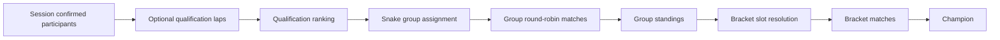
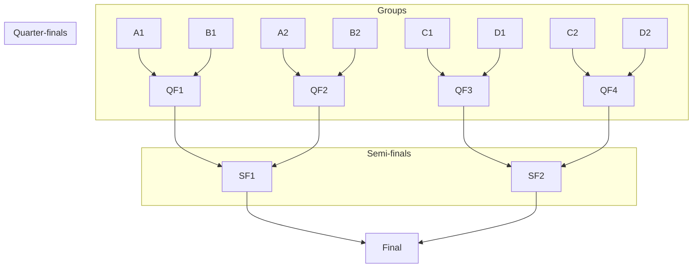
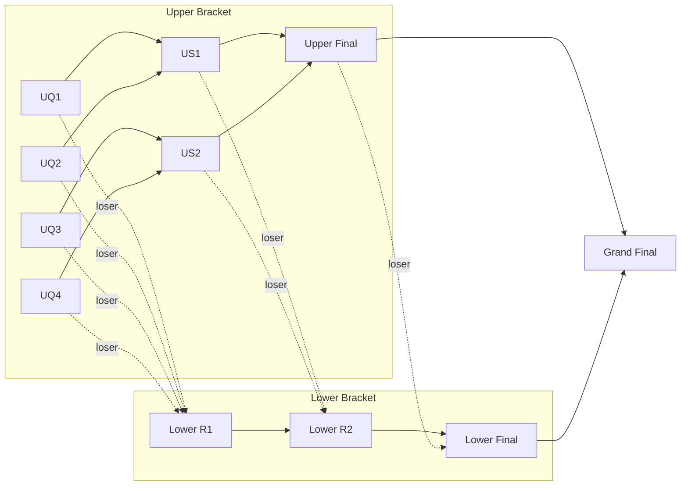
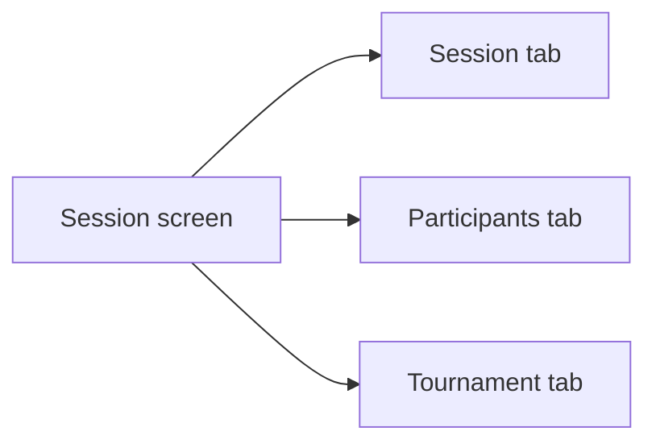

# Tournament Feature — Specification

This document is the canonical specification of the tournament feature. It describes the complete intended behavior of the feature, independent of which parts are currently built. It covers user-visible behavior, rules, invariants, and the architectural seams the implementation must preserve.

## 1. Overview

A **tournament** turns one confirmed session into structured competitive play. Admins and moderators configure a tournament against the session’s confirmed participants, optionally use shared qualification laps for ranking and tie-breaks, run group-stage round-robin play, then progress winners through a single- or double-elimination bracket. Tournament matches are normal matches that belong to tournament play; tournament progress is therefore visible everywhere a match appears, and is completed through the same match-editing flow used elsewhere.

A tournament has a single read model — **tournament details** — that drives every UI surface: previews while editing the create form, initial loads, and live updates after any change.

## 2. Domain Language

| Term                    | Meaning                                                                                                                             |
| ----------------------- | ----------------------------------------------------------------------------------------------------------------------------------- |
| **Tournament**          | Competition attached to one non-cancelled session.                                                                                  |
| **Participant**         | Confirmed (`yes`) signup of the session who is eligible for tournament play.                                                        |
| **Qualification track** | The single track on which qualification laps are run for this tournament.                                                           |
| **Qualification lap**   | An optional pre-tournament lap by a participant on the qualification track.                                                         |
| **Qualification rank**  | Stable ordering of participants used as the tournament-wide tiebreak.                                                               |
| **Group**               | Pool of participants playing each other before bracket play.                                                                        |
| **Standing**            | Ranked group result derived from completed group matches.                                                                           |
| **Stage**               | An ordered round of tournament play (group, round of 16, quarter-final, semi-final, final, grand final, lower-bracket equivalents). |
| **Bracket**             | Elimination path fed by group standings and prior match results. Either upper or lower.                                             |
| **Upper bracket**       | The winner-progression path. The only bracket in single elimination.                                                                |
| **Lower bracket**       | Loser-progression path in double elimination.                                                                                       |
| **Grand final**         | Final match between the upper bracket winner and lower bracket winner in double elimination.                                        |
| **Tournament match**    | A normal match record that belongs to tournament play.                                                                              |
| **Slot**                | A side of a tournament match (player 1 or player 2).                                                                                |
| **Slot dependency**     | Rule describing where a future slot’s player will come from: a group rank, a prior match winner, or a prior match loser.            |
| **Tournament draft**    | The fully-generated tournament structure for a given configuration, before persistence.                                             |
| **Tournament details**  | The single read model used by previews, fetches, and live updates.                                                                  |

## 3. Capabilities

Per role:

- **Admin / moderator**
  - Create a tournament from a session’s confirmed participants.
  - Preview a tournament from current form state without persisting.
  - Configure name, description, qualification track, group count, advancement count, elimination type, and per-stage tracks.
  - Delete an existing tournament for a session.
  - Complete tournament matches through the normal match flow.
- **Any user**
  - View tournament details for any session they can already view.
  - Update their own session RSVP from the session screen.

## 4. Tournament Lifecycle



The lifecycle is monotonic: once group play starts, qualification ranking is frozen; once a bracket slot has resolved to a player, only completion of upstream matches can change downstream slots; deletion ends the lifecycle for that session’s tournament.

## 5. Configuration

A tournament is described by a configuration with the following fields.

| Field               | Required       | Notes                                                                                                                                                                                                                      |
| ------------------- | -------------- | -------------------------------------------------------------------------------------------------------------------------------------------------------------------------------------------------------------------------- |
| Session             | Yes            | The non-cancelled session this tournament belongs to.                                                                                                                                                                      |
| Name                | Yes            | Non-blank.                                                                                                                                                                                                                 |
| Description         | No             |                                                                                                                                                                                                                            |
| Qualification track | Yes            | A single track. Selected via the shared lookup **`Combobox`** (searchable list of all tracks).                                                                                                                             |
| Groups count        | Yes            | Restricted to values that admit a valid bracket for the participant count.                                                                                                                                                 |
| Advancement count   | Yes            | Number of advancers per group. Restricted by participants, groups, and elimination type.                                                                                                                                   |
| Elimination type    | Yes            | `single` or `double`. `double` is only offered when at least one valid groups/advancement combination yields 4 or 8 advancers.                                                                                             |
| Per-stage tracks    | Per used stage | One or more tracks per stage that will appear in the draft. Stages not used are not configurable. Chosen with the shared **`ComboboxMulti`** so order is explicit and the same control supports search and multiple picks. |

### 5.1 Derived constraints

- The participant count is the count of session signups whose response is `yes`.
- A tournament needs **at least 4 participants**.
- Group count must satisfy `1 ≤ groupsCount ≤ participantCount`.
- Advancement count must satisfy `1 ≤ advancementCount ≤ floor(participantCount / groupsCount)`. The minimum group size is the floor; the rule guarantees every group can supply that many advancers.
- The total advancer count is `groupsCount × advancementCount`. It must be a power of two and at least 2.
- For `eliminationType = double`, total advancer count must be exactly **4 or 8**.
- The numeric **groups** and **advancement** dropdowns only list values whose combination satisfies all rules above for the current participant count and elimination type. Switching elimination type that invalidates the current selection silently snaps to a valid value.
- The double-elim option is disabled when no double-elim configuration is reachable for the participant count.

### 5.2 Stage track configuration

- A tournament has a configured set of tracks per stage that appears in its draft. Stages that the current configuration does not produce (e.g. `eight` with 8 advancers) are hidden from the form.
- When a stage becomes hidden as the configuration changes, any previously-stored tracks for that stage are pruned from the configuration.
- A stage may be configured with one or more tracks. There is no implicit fallback: empty configuration for a used stage means matches in that stage have no track.
- Track selection per stage is a list, not a set: order is preserved and used by the rotation rule (§ 11).

## 6. Qualification

Qualification provides ordering and the tournament-wide tiebreak.

### 6.1 Optionality

- Qualification laps are optional at create time. A tournament may be created before any participant has run a qualification lap.
- Once group play starts, the qualification ranking is **stable**: subsequent qualification laps do not re-seed already-formed groups.

### 6.2 Ranking rule

All participants are ranked into a single ordered list:

1. Participants with at least one valid lap on the qualification track come first, sorted ascending by their **best valid lap duration**, with `userId` as a stable tiebreak.
2. Participants with no valid lap come last, sorted **worst-rated → best-rated** using the global `Ranking` (`ranking` ascending number, then `totalRating` ascending, then `userId`).

A “valid lap” is a non-deleted time entry on the qualification track for the tournament’s session with a non-zero duration.

The first row gets `rank = 1`, the second `rank = 2`, and so on. Rank is contiguous across the timed and pending segments.

### 6.3 Tournament-wide tiebreak policy

Wherever the tournament needs a tiebreak — group standings, advancer ordering for bracket seeding, anywhere two participants tie — qualification rank is used as the deciding signal.

### 6.4 Qualification display

- Qualification rows are rendered with the same `TimeEntryRow` used by lap leaderboards, including the gap toggle (gap to leader vs gap to previous).
- A row whose participant has not yet run a qualification lap is displayed as **pending** (e.g. `Venter` in Norwegian), distinct from a true `DNF`. Pending rows show no position number, only an alignment spacer.
- Timed rows show their position number.

## 7. Groups

### 7.1 Snake assignment

Participants are assigned to groups using a serpentine pass over qualification rank:

- Rank 1 → group A, rank 2 → group B, …, rank N → group N (first row).
- Rank N+1 → group N (second row), N+2 → N-1, … (reverses every column).
- Continues until all participants are placed.

Group sizes differ by at most one. Participants need not divide evenly into groups.

### 7.2 Group naming

Groups are named with consecutive uppercase letters starting at `A`: `A`, `B`, `C`, …

## 8. Group Play

### 8.1 Match generation

Each group plays a single round-robin: every pair of group members meets exactly once. A group of size `n` produces `n × (n−1) / 2` group matches.

### 8.2 Match ordering

Two ordering rules apply, in this priority:

1. **Within a group**, the round-robin pairs are ordered greedily to maximize the spacing each player has between their consecutive appearances. At each slot, the pair chosen is the one whose smaller player-spacing is largest; ties break on the larger player-spacing. Players who have never appeared are treated as having infinite spacing.
2. **Across groups**, the per-group ordered queues are interleaved round-robin: one match from group A, one from B, one from C, …, repeating until all queues are empty. This further increases the distance between two appearances of the same player in the global sequence.

The result is the deterministic order in which group matches appear in tournament details, previews, and the matches list.

### 8.3 Group standings

A group standing assigns a rank to every player in the group based on completed group matches.

- Wins and losses are counted only from `completed` group matches with a winner that is one of the group’s players.
- Players are sorted by:
  1. Wins descending.
  2. Losses ascending.
  3. Qualification rank ascending (the tournament-wide tiebreak).
- Ranks are 1-based and contiguous.
- A row’s `qualifies` flag is true when its rank is `≤ advancementCount`.

Standings are deterministic at every state of group-stage progress: a group with no completed matches still produces a standing, ordered entirely by qualification rank.

## 9. Bracket

The bracket consumes the top `advancementCount` players from each group and runs an elimination tournament.

### 9.1 Advancer seeding

Advancers feed the bracket in a fixed order:

```
A1, B1, C1, D1, A2, B2, C2, D2, A3, …
```

That is: rank 1 across all groups in group order, then rank 2 across all groups, and so on, until `advancementCount × groupsCount` advancers are listed.

### 9.2 First-round pairing

The first bracket round pairs advancers as `(0, n−1), (1, n−2), …` over the seeded advancer list, where `n` is the total advancer count. This places the highest-seeded advancer against the lowest-seeded advancer in match 1, and so on.

### 9.3 Single elimination



- Each round halves the field.
- Every match is upper-bracket; there is no lower bracket.
- The last remaining match is the final.

### 9.4 Double elimination



- Upper bracket runs as in single elimination.
- Lower bracket round 1 pairs the losers of upper-bracket round 1.
- Each subsequent lower-bracket round pairs the previous lower-bracket winners with the losers of the corresponding upper-bracket round.
- The lower-bracket final pairs the last lower-bracket winner with the loser of the upper-bracket final.
- The grand final pairs the upper-bracket final winner with the lower-bracket final winner.
- Double elimination is only valid for 4 or 8 advancers.

### 9.4.1 Global match list order (double elimination)

In the **deterministic list** of all tournament matches (details, preview, session UI), **bracket** matches after group play are ordered so each **lower-bracket wave appears as soon as dependencies allow**, immediately after the upper-bracket round that feeds it:

- **Eight advancers:** all upper quarter-finals → lower quarter-finals → upper semi-finals → lower semi-finals (including the merge match) → upper final → lower final → grand final.
- **Four advancers:** both upper semi-finals → the lower semi (losers of those semis) → upper final → lower final → grand final.

Single elimination has no lower bracket; upper-bracket rounds stay in nested order as generated. Group-stage ordering remains § 8.2.

### 9.5 Stage naming

Stage names follow **rounds remaining** in the upper bracket, not a global round index. With `n` advancers, the upper bracket has `ceil(log₂ n)` rounds. For each upper-bracket round, the stage is determined by the number of rounds left until the final (1 = `final`, 2 = `semi`, 3 = `quarter`, 4 or more = `eight`, i.e. round of 16). The grand final has its own stage.

Lower-bracket stages mirror upper-bracket rounds. With `r = ceil(log₂ n)` rounds in the upper bracket:

- 1 lower-bracket round → `loser_final`.
- 2 rounds → `loser_semi`, `loser_final`.
- 3 rounds → `loser_quarter`, `loser_semi`, `loser_final`.
- 4+ rounds → `loser_eight`, `loser_quarter`, `loser_semi`, `loser_final`.

This rule fixes the long-standing bug of stages being named from a conflated global round index, which produced extra “finals” where semifinals were intended.

### 9.6 Slot dependencies

Every bracket slot has a structured dependency that names where its player will come from. There are exactly three kinds:

- `group_rank(groupId, rank)` — the player at `rank` in the standings of `groupId`. Used for first-round bracket slots.
- `match_winner(matchId)` — the winner of an upstream tournament match.
- `match_loser(matchId)` — the loser of an upstream tournament match.

A slot dependency is required for any slot that does not start with a known player.

### 9.7 Slot labels

Planned slots are labelled in human terms; the labels are derived from the structured dependencies and shared between the API payload and the UI rendering.

- `group_rank` with `rank = 1` → **“Winner of {Group name}”**.
- `group_rank` with `rank = 2` → **“Runner-up in {Group name}”**.
- `group_rank` with `rank ≥ 3` → **“{rank}. place in group {Group name}”**.
- `match_winner(m)` → **“Winner of {match label of m}”**.
- `match_loser(m)` → **“Loser of {match label of m}”**.

A match label resolves as:

- For a group match — the group match name.
- For a bracket match — the localized stage name (e.g. `Semi-final`), suffixed with a stable 1-based ordinal (e.g. `Semi-final 2`) when more than one match shares that stage in that bracket. Single-match stages drop the ordinal.

Bracket rows must not display opaque seed shorthand like `1D vs 2A` or anonymous “Winner / Loser” without a referent. Phrasing must always identify the feeder.

## 10. Slot Resolution

A slot is **resolved** when its dependency’s upstream is final:

- A `group_rank` slot resolves once group standings are stable enough that the rank is determined. In the first build this is when group play is complete; partial-completion resolution may be added later.
- A `match_winner` / `match_loser` slot resolves when the referenced match is `completed` and has a winner.

When a tournament-relevant change happens — a tournament match is completed, edited, uncompleted, or planned again — slot resolution runs across the whole tournament. Resolution is a **fixed-point** computation: it iterates until no further slot changes player. Resolved slots write their player into the underlying match record so all match-shaped UIs see the same players.

When an upstream result changes such that a downstream slot would resolve to a different player, the downstream player is overwritten. Players assigned by manual editing of group-stage matches are not affected — only bracket-slot players are recomputed.

## 11. Track Distribution

- A stage’s configured tracks are distributed across that stage’s matches by **even rotation**: match `i` (0-based) within a stage uses configured track `i mod T`, where `T` is the number of configured tracks for the stage.
- Across a stage, the difference between the most-used and least-used configured track is at most one.
- Stages are isolated: tracks configured for one stage are not used as a fallback for any other stage. A used stage with no configured tracks yields matches with no track.
- Track distribution applies identically in preview and in created tournaments.

## 12. Preview

The preview gives the admin a complete picture of the tournament that would be created right now.

- The preview is **driven by tournament structure fields** (tracks, group/advancement counts, elimination type, per-stage tracks) and refreshes when those change (debounced ≈ 380 ms; only the latest run’s result is applied). **Name and description** do not trigger preview refresh; they only affect creation and the live tournament header after save.
- A preview is generated by the same draft pipeline as creation. There is **no second code path** that invents a different bracket, ordering, or track assignment for preview.
- The preview is delivered as the same `tournament details` shape as a live tournament, with synthetic identifiers for the tournament, groups, and tournament matches.
- The preview reuses live UI components: `TimeEntryRow` for qualification rows and `MatchRow` for tournament matches. Bracket matches without a real match record are rendered as `MatchRow` in `readOnly` mode with the slot labels described in § 9.7.
- The qualification list in the preview reflects the actual current qualification state: timed and pending rows are differentiated, and pending rows obey the same display rules as in a live tournament.
- The preview pane fills the remaining horizontal space next to the form, with the form column constrained and the preview column flexible (`grid` with a bounded form column and a `1fr` preview column; `min-w-0` where needed). The preview pane stays sticky on large screens.
- A spinner appears in the preview when a refresh is in flight; the previously-rendered preview remains visible until the new one arrives.
- The preview **header** in `TournamentPanel` (when `isPreview` is true) does **not** show the tournament name or description. It shows **`workloadSummary`** from the read model: **distinct track count** (qualification track plus every distinct track id assigned to a tournament match in the draft), **qualification laps per player** (one qualification attempt each), and **minimum–maximum tournament matches per player** (group stage by smallest vs largest group size, plus bracket caps from elimination type and advancer count). These bounds are **structural** for the configured format, not derived from live bracket resolution. Progress lines for overall and group match counts may still appear below.
- The **live** tournament tab keeps the normal title and description header; `workloadSummary` is still present on the payload for clients that want it.

## 13. Creation

- Submitting the create form triggers backend validation, draft generation, and persistence in a single command path.
- The backend re-validates everything that the form validates, plus that no active tournament exists for the session and that the session is not cancelled. Invalid input returns a localized error and does not mutate state.
- Creation is **gated** until:
  - The form is fully valid (name, qualification track, group count, advancement count, elimination type all set; participant count meets the minimum).
  - The latest preview has resolved and is not loading.
  - **Every match in the latest draft has a non-null track** — this surfaces in the form as a custom validity message until the user has configured tracks for every used stage.
- A successful creation persists the tournament, the per-stage track configuration, the groups, the group players, and one tournament match per draft match (each backed by a normal match record). Persistence is atomic: any failure during creation rolls back the entire tournament.
- Immediately after persistence, slot resolution (§ 10) runs once. Any slot that is already resolvable from existing data writes its player into the underlying match.
- After a successful creation, the user is returned to the session view; a toast confirms the result.

## 14. Match Completion & Bracket Progression

- Tournament matches are completed through the normal match-editing flow. The tournament feature does not introduce a separate way to enter results.
- Whenever a match that belongs to a tournament is created, edited, or its status changes, slot resolution (§ 10) runs across that tournament before any broadcast.
- Slot resolution and broadcasts run within the same logical step so that clients always observe the new bracket state in the same refresh as the new match state.

## 15. Deletion

- Deletion is an admin/moderator action against a session.
- Deletion **soft-deletes** the tournament and all of its dependent records: the per-stage track configuration, the groups, the group players, the tournament-match records, and the underlying match records. After deletion none of these are visible to any user.
- Deletion is idempotent: deleting when no active tournament exists is a no-op.
- After deletion, the session’s tournament details payload is `null`, and the session screen falls back to its no-tournament state (§ 16.3).
- Deletion does not affect non-tournament matches or qualification time entries — qualification laps remain visible as ordinary lap times.

## 16. Session Screen Layout

The session detail screen exposes tournament play through a three-tab layout.



### 16.1 Session tab

- Lists **non-tournament** matches and lap times for the session.
- Per-track leaderboards behave exactly as before tournament play exists: same components, same filters.

### 16.2 Participants tab

- Lists every signup with their RSVP status, grouped or listed using the existing signup UI.
- Includes a **self-RSVP module** for the current logged-in user to update their own response (yes / maybe / no) for this session.
- Includes a **summary** of how many signups answered yes vs maybe vs no.

### 16.3 Tournament tab

- When a tournament exists for the session: renders tournament details, including qualification, group standings, all tournament matches in deterministic order (§ 8.2, § 9, § 9.4.1 for double-elim ordering), and progress summaries.
- Match rows inside the tab are `MatchRow` components; bracket rows that have no resolved players use the slot labels from § 9.7.
- When no tournament exists and the viewer is admin/moderator: shows a clear **Create tournament** entry point linking to the dedicated create page for the session.
- When no tournament exists and the viewer is a regular user: shows a no-items message; no create entry point is offered.

### 16.4 Standings layout

- Group standings are rendered as one block per group.
- Standings blocks lay out as a single column on small screens and switch to two columns from breakpoint `xl` upward.

## 17. Permissions

| Action                    | Required role                          |
| ------------------------- | -------------------------------------- |
| View tournament details   | Any client                             |
| Update own session RSVP   | Any logged-in user                     |
| Preview tournament        | Admin or moderator                     |
| Create tournament         | Admin or moderator                     |
| Delete tournament         | Admin or moderator                     |
| Complete tournament match | Same policy as normal match completion |

Frontend role checks must mirror backend enforcement: hiding a button must coincide with the server rejecting the equivalent request. Unauthorized realtime traffic is dropped silently.

## 18. Validation & Errors

Validation runs **before** any state mutation. Each rule has a localized user-facing message; failure surfaces through the same toast mechanism as other backend errors.

| Rule                                                                                                                              | Surfaced when                                                 |
| --------------------------------------------------------------------------------------------------------------------------------- | ------------------------------------------------------------- |
| The session exists and is not cancelled.                                                                                          | Preview, create, delete                                       |
| The actor has admin or moderator role.                                                                                            | Preview, create, delete                                       |
| At least 4 confirmed participants.                                                                                                | Preview, create                                               |
| Group count fits the participant count (`1 ≤ g ≤ p`).                                                                             | Preview, create                                               |
| Advancement count fits group count and participant count (`1 ≤ a ≤ floor(p / g)`).                                                | Preview, create                                               |
| Total advancers (`g × a`) is a power of two and at least 2.                                                                       | Preview, create                                               |
| Double elimination requires exactly 4 or 8 advancers.                                                                             | Preview, create                                               |
| Qualification track exists.                                                                                                       | Preview, create                                               |
| Per-stage tracks reference existing tracks.                                                                                       | Preview, create                                               |
| **Every** match in the generated draft has a non-null track.                                                                      | Create only — preview shows missing tracks but does not fail. |
| No active tournament already exists for the session.                                                                              | Create                                                        |
| Slot dependencies in the generated draft are valid (every non-known slot points at a real upstream group rank or upstream match). | Create                                                        |

The form blocks submission as long as any client-checkable rule fails, including the “every draft match has a track” rule which becomes a custom-validity message on a hidden readiness input.

Unsupported configurations from the first build (e.g. configurations that would require `bronze` or `loser_bronze` matches, or bracket-reset matches) are rejected explicitly rather than silently degraded.

## 19. Realtime & Visibility

- Tournament details are broadcast on a per-session topic. Every connected client viewing that session receives them.
- A broadcast is emitted after **every** durable change that affects tournament state: creation, deletion, and any match update that touches a tournament match. Slot resolution always runs before the broadcast so clients see the updated bracket state in the same refresh as the underlying match update.
- Match changes that touch a tournament also emit the standard `all matches` payload, so non-tournament views stay consistent with tournament views.
- The frontend listener path is identical to the initial-load path: tournament details replace the previously-stored value wholesale. UI does not patch nested tournament state with separate rules.
- Role-aware emission ensures clients only receive payloads they can see. A regular user never receives an admin-only payload.
- The shared toast framework surfaces tournament outcomes (created, deleted, error). Toasts stay reusable for future status alerts.

## 20. Out of Scope

The following are deliberately not part of this feature, and the implementation must reject configurations that would require them:

- Editing tournament structure after creation. Re-creation requires deletion first.
- Tiebreakers beyond qualification ranking (e.g. head-to-head, point differentials).
- Bracket reset matches (a second grand-final game when the lower-bracket winner wins the first).
- A standalone tournament area outside session pages.

## 21. Architecture & Deepening Invariants

This section names the **Modules** the implementation must keep, the **Interfaces** they expose, and the **Seams** to defend during future change. Vocabulary is intentionally precise: a Module has an interface and an implementation; a Seam is where an interface lives and behavior can change without editing in place; an Adapter is a concrete thing satisfying an interface at a Seam; Depth is leverage at the interface; Locality is having change, bugs, and knowledge concentrated in one place.

### 21.1 Tournament Command Module

**Interface goal**: one command surface for preview, creation, deletion, and reaction-to-match-results.

Behavior the Interface owns:

- Role enforcement.
- Input shape validation and tournament rule validation.
- Coordinating draft generation, persistence, slot resolution, and broadcast.
- Mapping internal validation failures to localized user-facing messages.

Callers (session pages, socket handlers, match editing) must go through this Interface. They must not reach into the Draft, Persistence, Standings, Slot Resolution, or Query Modules directly. Depth here comes from orchestration locality: the bug for “my creation didn’t broadcast” lives in one place.

### 21.2 Tournament Draft Module

**Interface goal**: turn a configuration plus a qualification-ranked participant list into a complete tournament structure, with **no side effects**.

Behavior the Interface owns:

- Snake group assignment and group naming (§ 7).
- Per-group round-robin generation with player-spacing ordering (§ 8.1, § 8.2).
- Cross-group interleaving of group-match queues (§ 8.2).
- Single- and double-elimination bracket structure (§ 9), including double-elim global list order (§ 9.4.1), stage naming (§ 9.5), and structured slot dependencies (§ 9.6).
- Even per-stage track assignment (§ 11).

The same Interface produces the structure used by both **preview** and **creation**. This is the load-bearing seam of the feature: one rule set, two workflows, one test surface. A second draft path for preview is forbidden.

### 21.3 Tournament Persistence Adapter

**Interface goal**: save and load tournament structures without leaking storage details into rule logic.

Behavior the Interface owns:

- Atomic persistence of the tournament, stage tracks, groups, group players, and tournament-match records.
- Soft-delete of all records belonging to a tournament.
- A pure function that turns a draft into the same `tournament details` shape used everywhere else, for the preview path.

This is a real Seam — there are two Adapters: an in-memory adapter producing preview details from a draft, and a durable storage adapter producing tournament details from persisted rows. The fact that two Adapters exist is what justifies treating this as a Seam rather than an internal helper.

### 21.4 Standings Module

**Interface goal**: deterministic ranking from a group, its players, its completed matches, the tournament-wide qualification rank, and the advancement count.

Behavior the Interface owns:

- Win/loss counting from completed matches.
- Sort order: wins desc, losses asc, qualification rank asc.
- Advancement marking against the configured count.
- Producing a usable standing even when no matches have been played.

Ranking policy must not appear in the UI, in the Query Module, or in the Slot Resolution Module. If a future tiebreak (e.g. head-to-head) is added, it goes here.

### 21.5 Slot Resolution Module

**Interface goal**: compute, for a tournament, the resolved players for every bracket slot from current standings and current match results, and propagate those players into the match records.

Behavior the Interface owns:

- Reading group standings and match-winner / match-loser sources.
- Iterating to a fixed point so multi-step progressions converge in one call.
- Updating only the player columns of the match record so the rest of match behavior is unchanged.

Normal match editing reports a tournament-relevant change to the Command Module, which calls this Interface. Normal match editing does not need to know about brackets.

### 21.6 Tournament Query Module

**Interface goal**: return complete `tournament details` ready for UI consumption, for a session.

Behavior the Interface owns:

- Shaping a persisted tournament into the canonical read model.
- Including qualification rows (with pending vs timed differentiation), groups, standings, all tournament matches in their deterministic order with stage names, slot labels, dependency objects, track ids, and progress summary fields.
- Attaching **`workloadSummary`** (distinct tracks, per-player qualification lap count, min–max tournament matches per player) computed deterministically from group sizes, advancer count, elimination type, and assigned track ids—same for preview and persisted details.
- Filtering deleted records consistently.

The same shape is used for explicit fetches, preview generation (with synthetic ids), and live broadcasts. The Query Module is the **single read model Interface** for the whole feature; there is no second details payload for any consumer.

### 21.7 Frontend Tournament Form Module

**Interface goal**: let admins/moderators configure, preview, and create a tournament, using the Command Module as the only command path.

Behavior the Interface owns:

- Limiting numeric pickers to valid values (§ 5.1) using shared option helpers.
- Hiding stage track configuration for unused stages and pruning stale picks (§ 5.2).
- Driving a debounced auto-preview on structural form changes (§ 12), excluding name and description.
- Surfacing backend validation errors through the shared toast.
- Blocking submission until the readiness condition is met (§ 13).
- Reusing the same `tournament details` view component for preview and live tournament rendering.

**Lookup selects (tracks, players, sessions, and any other entity picked from the global catalog)** use the shared **`Combobox`** and **`ComboboxMulti`** components in `frontend/components/combobox.tsx`. They share one implementation (`LookupCombobox`): single selection vs multi-selection is exposed as two named components so call sites stay obvious. Numeric and enum fields (e.g. groups count, elimination type) stay on **`NativeSelect`** or other non-search controls. Match and time-entry forms already use **`Combobox`** for user, track, and session lookups; the tournament create flow uses **`Combobox`** for the qualification track and **`ComboboxMulti`** for each used stage’s ordered track list.

### 21.8 Frontend Tournament View Module

**Interface goal**: render `tournament details` directly, without recomputing rules.

Behavior the Interface owns:

- Qualification list rendering through the shared `TimeEntryRow`, including pending vs timed handling and the gap toggle (§ 6.4).
- Group standings rendering with the responsive two-column layout (§ 16.4).
- Tournament match rendering through the shared `MatchRow`, with `readOnly` for synthetic preview rows and unresolved bracket slots, using slot labels from § 9.7.
- Refreshing through the same data-loading path used on initial load.

The View Module is forbidden from re-deriving anything in `tournament details` — if it needs a value, the value must already be present in the read model.

### 21.9 Architectural invariants to defend

Future changes must preserve all of the following:

1. **One draft pipeline** — preview and creation use the same Draft Module. Adding a “preview-only quick path” regenerates this whole class of bug.
2. **One read model** — preview, fetch, and broadcast all carry the same `tournament details` shape. Adding a “preview details” type or a “broadcast diff” type splits frontend state handling.
3. **Reactive contract** — every durable tournament-affecting change refreshes tournament details and the affected match payloads, after slot resolution has run.
4. **Locality of ranking** — the tournament-wide tiebreak policy (qualification rank) lives in exactly one place and is consumed by anyone who needs ordering.
5. **Locality of progression** — slot resolution is a single fixed-point pass, owned by the Slot Resolution Module. Match editing must not know about brackets.
6. **Stage isolation for tracks** — no cross-stage fallback for track configuration, ever.
7. **Structured dependencies, not strings** — slot relationships are represented by `group_rank` / `match_winner` / `match_loser` objects; user-facing slot labels are derived. Hardcoding strings like `1D vs 2A` anywhere bypasses the Slot Resolution Module and the label format.

Any change that would erode one of these invariants requires either a new ADR explicitly accepting the trade-off, or a redesign of the Module whose Interface is being weakened.
