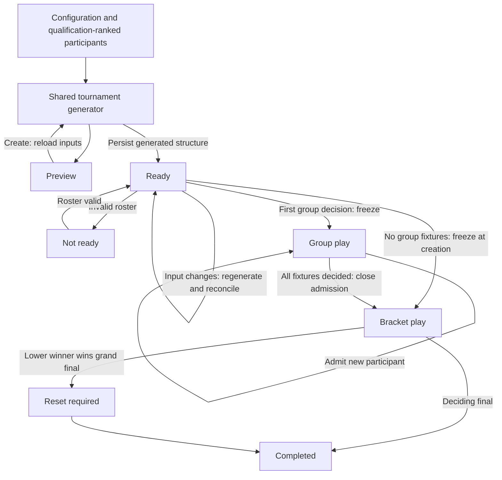

# Tournament implementation

## Architecture

The Tournament Module exposes commands through `tournament.manager.ts`. Its private implementation uses `tournament.draft.ts` for the single pure generator, `tournament.rules.ts` for ranking/progression, and `tournament.details.ts` for the canonical read model. Preview and creation call exactly the same generator; saving only assigns durable IDs and stores its output. Existing match records, rating calculations, editors, rows, qualification rows, lookup controls and toasts are reused.

Historical restoration is excluded. CSV remains raw database writes without tournament validation. This document supersedes earlier tournament implementation plans.

## Stages

1. Working single elimination: schema, generation, persistence, freeze, progression, existing UI, preview, and realtime. Development milestone using a stable roster.
2. Complete formats and lifecycle: double elimination/reset, changing rosters, preserved fixtures, admission, awards, corrections, session lifecycle, and reactive integration.
3. Verification: pure and command tests, migration checks, CSV round trips, concurrent requests, restart and multiple clients, browser checks, typecheck and build.

## Lifecycle

Cancellation suspends play at its current phase; restoration resumes it. Deletion soft-deletes the tournament and its matches. Undo never unfreezes qualification or reopens admission.

## Verification

Run `npm test`, `npm run check`, and `npm run build`. Tests use disposable SQLite databases via `DATABASE_PATH`; normal operation defaults to `data/db.sqlite`. Run `npm run db:gen` after schema changes; never rewrite applied migrations.

## File responsibilities

- `common/models/tournament.ts`: shared configuration, generated structure, dependencies and read model.
- `common/utils/tournament.ts`: shared configuration options and stage names.
- `backend/src/managers/tournament.manager.ts`: command validation, transactions, persistence, reconciliation and mutation coordination.
- `backend/src/managers/tournament.draft.ts`: single generator for preview and creation, reusable scheduling.
- `backend/src/managers/tournament.rules.ts`: qualification, standings, progression and correction protection.
- `backend/src/managers/tournament.details.ts`: shared read model and display metadata.
- `frontend/components/tournament/TournamentForm.tsx`: configuration, server preview and readiness.
- `frontend/components/tournament/TournamentPanel.tsx`: shared preview/live presentation through existing rows.
- `frontend/app/pages/TournamentCreatePage.tsx`: route and navigation.
- `frontend/hooks/useTournament.ts`: fetch, subscription, reconnect and notifications.
- Existing match Modules and rows: normal storage, rating input, slot labels and result editing.
- Existing session/time-entry/user Modules: explicit tournament refresh for relevant changes.
- Existing database schema, CSV mappings, socket contracts, locale and routing: integration.
