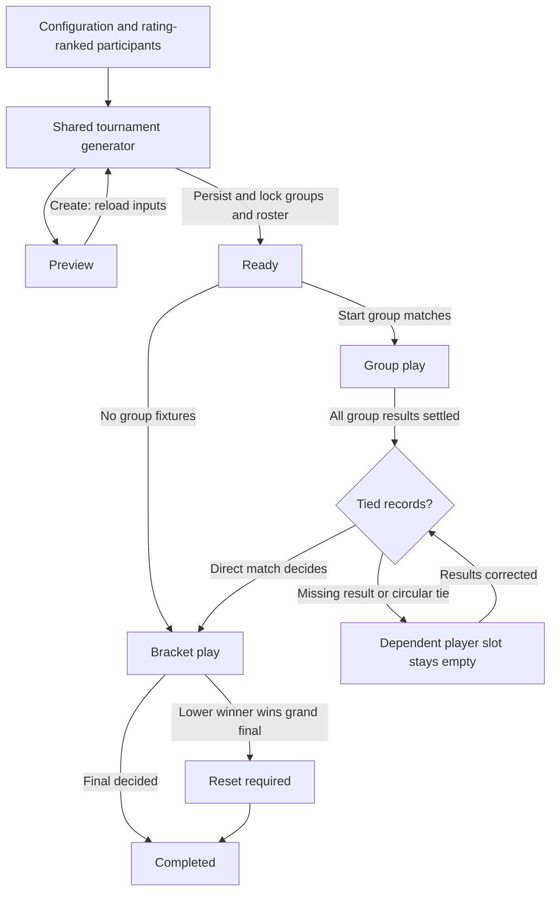

# Tournament implementation

## Architecture

The Tournament Module exposes commands through `tournament.manager.ts`. Its private implementation uses `tournament.draft.ts` for the single pure generator, `tournament.rules.ts` for ranking/progression, and `tournament.details.ts` for the canonical read model. Preview and creation call exactly the same generator; saving only assigns durable IDs and stores its output. Existing match records, rating calculations, editors, rows, lookup controls and toasts are reused.

Historical restoration is excluded. CSV remains raw database writes without tournament validation. This document supersedes earlier tournament implementation plans.

Preview and creation use rating-based seeding. Creation locks the groups, participant roster, and match schedule; later session signup and rating changes do not regenerate the tournament.

Equal win/loss ratios use the decided direct match in the current round. Missing direct results and circular multi-player ties remain unresolved; affected group-rank slots return null and stop progression. Ratings and lap times never break result ties. Final placements without a deciding head-to-head result share a rank.

Admins and moderators can change either bracket player through the existing match editor, including resolved slots and participants from other groups. Overrides persist alongside the slot dependency; clearing restores automatic resolution. Temporary duplicates across matches allow sequential swaps. Tournament results still require two distinct players and a valid winner; planned downstream matches follow corrections, while decided downstream matches remain protected.

There is no qualification track, lap draft generation, or tie-breaker panel. Existing lap records and applied migrations are preserved; tournaments no longer read or lock them. A lap-based tie-breaker system is deferred to a separate PR.

## Stages

1. Working single elimination: schema, generation, persistence, freeze, progression, existing UI, preview, and realtime. Development milestone using a stable roster.
2. Complete formats and lifecycle: double elimination/reset, fixed rosters, preserved fixtures, awards, corrections, session lifecycle, and reactive integration.
3. Verification: pure and command tests, migration checks, CSV round trips, concurrent requests, restart and multiple clients, browser checks, typecheck and build.

## Lifecycle

Cancellation suspends play at its current phase; restoration resumes it. Tournament deletion asks whether to keep or soft-delete its matches. Lap times are preserved. Kept matches become ordinary editable matches. Other session results are preserved. Undo never unfreezes the roster or reopens admission.

## Verification

Run `npm test`, `npm run check`, and `npm run build`. Tests use disposable SQLite databases via `DATABASE_PATH`; normal operation defaults to `data/db.sqlite`. Run `npm run db:gen` after schema changes; never rewrite applied migrations.

## File responsibilities

- `common/models/tournament.ts`: shared configuration, generated structure, dependencies and read model.
- `common/utils/tournament.ts`: shared configuration options and stage names.
- `backend/src/managers/tournament.manager.ts`: command validation, transactions, fixed-structure persistence, match updates and tournament notifications.
- `backend/src/managers/tournament.draft.ts`: single generator for preview and creation, reusable scheduling.
- `backend/src/managers/tournament.rules.ts`: seeding, head-to-head standings, progression and correction protection.
- `backend/src/managers/tournament.details.ts`: shared read model and display metadata.
- `frontend/components/tournament/TournamentForm.tsx`: configuration, server preview and readiness.
- `frontend/components/tournament/TournamentPanel.tsx`: shared preview/live presentation through existing rows.
- `frontend/components/tournament/TournamentGroupPanel.tsx`: group cards with ranked standings, win/loss columns and highlighted advancement places.
- `frontend/app/pages/TournamentCreatePage.tsx`: route and navigation.
- `frontend/hooks/useTournament.ts`: fetch, subscription, reconnect and notifications.
- `frontend/components/ComboboxMulti.tsx`: ordered multi-selection through the shared combobox, with custom rows for options and selected items.
- `backend/src/managers/tournament.rules.spec.ts`: deterministic generation, progression, correction protection, and both double-elimination reset paths.
- `backend/src/managers/tournament.manager.spec.ts`: real socket commands, permissions, concurrent creation, persistence/restart, fixed groups after creation, corrections, CSV and lifecycle integration.
- `backend/database/database.spec.ts`: clean migration and upgrade preserving ordinary data.
- `drizzle/0011_abandoned_storm.sql`, `drizzle/meta/0011_snapshot.json`: generated tournament migration and schema snapshot.
- `drizzle/0012_minor_silver_fox.sql`, `drizzle/meta/0012_snapshot.json`: qualification draft flag migration and schema snapshot.
- `CONTEXT.md`: domain language and module boundaries.
- `docs/tournament-implementation.md`: staged implementation, lifecycle diagram and file inventory.

### Changed files

- `.env.example`: optional disposable database path.
- `backend/database/database.ts`, `drizzle.config.ts`: honor `DATABASE_PATH`.
- `backend/database/schema.ts`: tournament tables, slot dependencies, snapshots and uniqueness constraints.
- `drizzle/meta/_journal.json`: register generated migration.
- `backend/src/managers/admin.manager.ts`: all tournament tables in CSV import/export, publish imported state.
- `backend/src/utils/csv-parser.ts`: parse JSON structures, draft booleans and snapshot timestamps without domain validation.
- `backend/src/managers/match.manager.ts`: delegate tournament results, coordinate ordinary changes, return enriched matches.
- `backend/src/managers/rating.manager.ts`: synchronous rating rebuild so freeze snapshots and mutations are atomic.
- `backend/src/managers/session.manager.ts`: remove the affected tournament when deleting a session; publish cancellation/restoration through the canonical read model. Signups never rewrite tournaments.
- `backend/src/managers/timeEntry.manager.ts`: coordinate ordinary lap changes and implicit signups.
- `backend/src/managers/user.manager.ts`: delete users and their lap times atomically while preserving saved tournament rosters.
- `backend/src/server.ts`: register commands and support direct production route loads in hidden worktree directories.
- `common/locale/locales.ts`: tournament labels, errors, stages and CSV table names.
- `common/models/match.ts`: compact tournament labels, slot labels and editing/reset state. Dependency objects remain private to tournament state.
- `common/models/socket.io.ts`: typed tournament commands and change event.
- `frontend/App.tsx`: tournament creation route.
- `frontend/app/pages/SessionPage.tsx`: session, participant and tournament tabs plus create/delete actions.
- `frontend/components/combobox.tsx`: shared lookup behavior and row contract reused by ordered multi-track selection.
- `frontend/components/match/MatchInput.tsx`: lock tournament-owned fields and support awarded results.
- `frontend/components/match/MatchList.tsx`: managed/read-only lists and preserved scheduling order.
- `frontend/components/match/MatchRow.tsx`: unresolved labels, conditional resets, awards and result controls.
- `frontend/components/session/SessionSignupPanel.tsx`: reuse signup summary and native response selector.
- `frontend/components/track/TrackLeaderboard.tsx`: separate tournament matches on session view and omit unneeded resets.
- `frontend/contexts/TimeEntryInputContext.tsx`: current match data and tournament editing restrictions.
- `package.json`: run backend and frontend tests through the existing TypeScript loader and Node test runner.

## Completed verification

All 22 tests pass, including real server/socket tests, disposable database migrations and the shared progress display. `npm run check` and `npm run build` pass. Coverage includes equal records, circular ties, matches from other rounds, null slots, preview isolation, fixed groups, unchanged tournament rows after ordinary lap/signup edits, participant deletion, unrelated tournaments surviving session deletion, CSV boolean round trips, and manual player assignment across restarts. Historical data restoration remains a manual follow-up outside this implementation.
