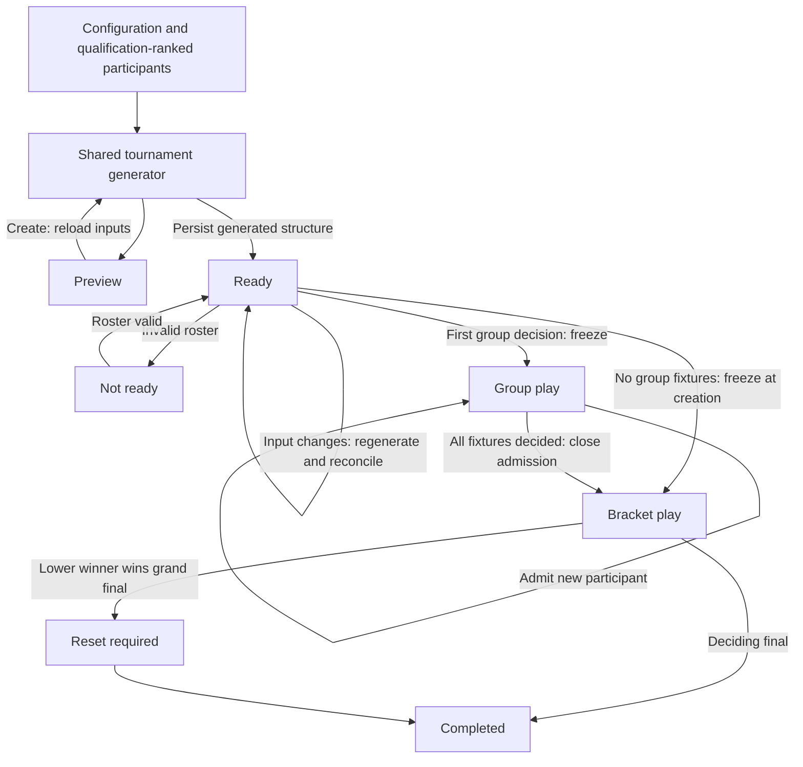

# Tournament implementation

## Architecture

The Tournament Module exposes commands through `tournament.manager.ts`. Its private implementation uses `tournament.draft.ts` for the single pure generator, `tournament.rules.ts` for ranking/progression, and `tournament.details.ts` for the canonical read model. Preview and creation call exactly the same generator; saving only assigns durable IDs and stores its output. Existing match records, rating calculations, editors, rows, qualification rows, lookup controls and toasts are reused.

Historical restoration is excluded. CSV remains raw database writes without tournament validation. This document supersedes earlier tournament implementation plans.

Preview only reads existing data and generates an in-memory tournament; it never writes to the database. Its qualification list displays existing lap times and in-memory drafts for missing qualification laps without editing or creation controls. Saving the tournament persists missing qualification drafts as normal time entries, and cancelled drafts are not recreated. Saved tournament details carries these entries directly to the shared `TimeEntryList` for editing and cancellation.

## Stages

1. Working single elimination: schema, generation, persistence, freeze, progression, existing UI, preview, and realtime. Development milestone using a stable roster.
2. Complete formats and lifecycle: double elimination/reset, changing rosters, preserved fixtures, admission, awards, corrections, session lifecycle, and reactive integration.
3. Verification: pure and command tests, migration checks, CSV round trips, concurrent requests, restart and multiple clients, browser checks, typecheck and build.

## Lifecycle

Cancellation suspends play at its current phase; restoration resumes it. Tournament deletion asks whether to keep or soft-delete its matches and participants' qualification laps. Kept matches become ordinary editable matches. Other session results are preserved. Undo never unfreezes qualification or reopens admission.

## Verification

Run `npm test`, `npm run check`, and `npm run build`. Tests use disposable SQLite databases via `DATABASE_PATH`; normal operation defaults to `data/db.sqlite`. Run `npm run db:gen` after schema changes; never rewrite applied migrations.

## File responsibilities

- `common/models/tournament.ts`: shared configuration, generated structure, dependencies and read model.
- `common/utils/tournament.ts`: shared configuration options and stage names.
- `backend/src/managers/tournament.manager.ts`: command validation, transactions, persistence, reconciliation and mutation coordination.
- `backend/src/managers/tournament.draft.ts`: single generator for preview and creation, reusable scheduling.
- `backend/src/managers/tournament.rules.ts`: qualification, standings, progression and correction protection.
- `backend/src/managers/tournament.details.ts`: shared read model and display metadata.
- `frontend/components/tournament/TournamentForm.tsx`: configuration, server preview and readiness.
- `frontend/components/tournament/TournamentPanel.tsx`: shared preview/live presentation through existing rows.
- `frontend/components/tournament/TournamentGroupPanel.tsx`: group cards with ranked standings, win/loss columns and highlighted advancement places.
- `frontend/app/pages/TournamentCreatePage.tsx`: route and navigation.
- `frontend/hooks/useTournament.ts`: fetch, subscription, reconnect and notifications.
- `frontend/components/ComboboxMulti.tsx`: ordered multi-selection through the shared combobox, with custom rows for options and selected items.
- `backend/src/managers/tournament.rules.spec.ts`: deterministic generation, progression, correction protection, and both double-elimination reset paths.
- `backend/src/managers/tournament.manager.spec.ts`: real socket commands, permissions, concurrent creation, persistence/restart, freeze/admission, corrections, CSV and lifecycle integration.
- `backend/database/database.spec.ts`: clean migration and upgrade preserving ordinary data.
- `drizzle/0011_abandoned_storm.sql`, `drizzle/meta/0011_snapshot.json`: generated tournament migration and schema snapshot.
- `drizzle/0012_minor_silver_fox.sql`, `drizzle/meta/0012_snapshot.json`: qualification draft flag migration and schema snapshot.
- `CONTEXT.md`: domain language and module boundaries.
- `docs/tournament-implementation.md`: staged implementation, lifecycle diagram and file inventory.

### Changed files

- `.env.example`: optional disposable database path.
- `backend/database/database.ts`, `drizzle.config.ts`: honor `DATABASE_PATH`.
- `backend/database/schema.ts`: tournament tables, qualification drafts, slot dependencies, snapshots and uniqueness constraints.
- `drizzle/meta/_journal.json`: register generated migration.
- `backend/src/managers/admin.manager.ts`: all tournament tables in CSV import/export, publish imported state.
- `backend/src/utils/csv-parser.ts`: parse JSON structures and snapshot timestamps without domain validation.
- `backend/src/managers/match.manager.ts`: delegate tournament results, coordinate ordinary changes, return enriched matches.
- `backend/src/managers/rating.manager.ts`: synchronous rating rebuild so freeze snapshots and mutations are atomic.
- `backend/src/managers/session.manager.ts`: coordinate signup and session lifecycle mutations with tournament state.
- `backend/src/managers/timeEntry.manager.ts`: coordinate qualification changes and implicit signups.
- `backend/src/managers/user.manager.ts`: coordinate participant deletion.
- `backend/src/server.ts`: register commands and support direct production route loads in hidden worktree directories.
- `common/locale/locales.ts`: tournament labels, errors, stages and CSV table names.
- `common/models/match.ts`: tournament metadata, dependency objects, round sizes and slot labels.
- `common/models/socket.io.ts`: typed tournament commands and change event.
- `frontend/App.tsx`: tournament creation route.
- `frontend/app/pages/SessionPage.tsx`: session, participant and tournament tabs plus create/delete actions.
- `frontend/components/combobox.tsx`: shared lookup behavior and row contract reused by ordered multi-track selection.
- `frontend/components/match/MatchInput.tsx`: lock tournament-owned fields and support awarded results.
- `frontend/components/match/MatchList.tsx`: managed/read-only lists and preserved scheduling order.
- `frontend/components/match/MatchRow.tsx`: unresolved labels, conditional resets, awards and result controls.
- `frontend/components/session/SessionSignupPanel.tsx`: reuse signup summary and native response selector.
- `frontend/components/timeentries/TimeEntryList.tsx`, `frontend/components/timeentries/TimeEntryRow.tsx`: editable qualification drafts and pending players without fabricated gaps.
- `frontend/components/track/TrackLeaderboard.tsx`: separate tournament matches on session view and omit unneeded resets.
- `frontend/contexts/TimeEntryInputContext.tsx`: current match data and tournament editing restrictions.
- `package.json`: Node test-runner command using the existing TypeScript loader.

## Completed verification

All 16 tests pass, including real server/socket tests and disposable database migrations. `npm run check` and `npm run build` pass. Browser verification covered login, direct creation-route loading, configuration and preview, creation, the tournament tab, recording a result, qualification freezing, and persistence after reload. Historical data restoration remains a manual follow-up outside this implementation.
